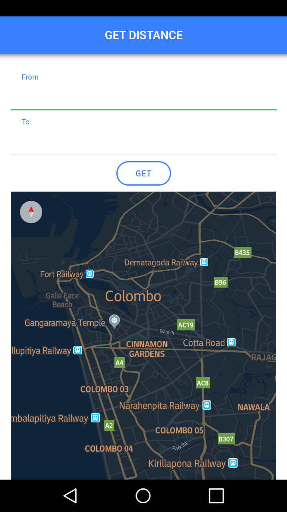
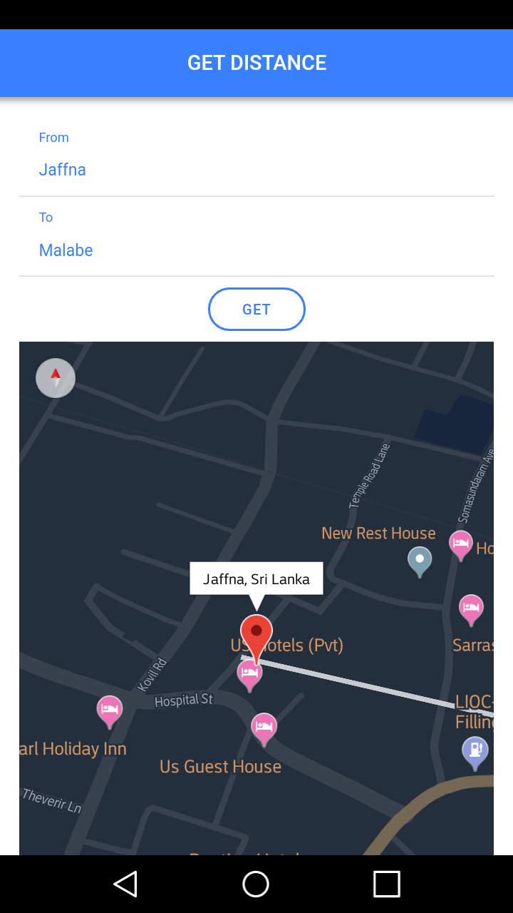
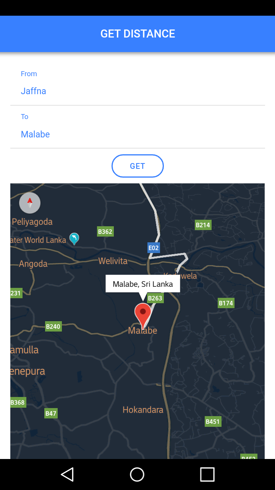
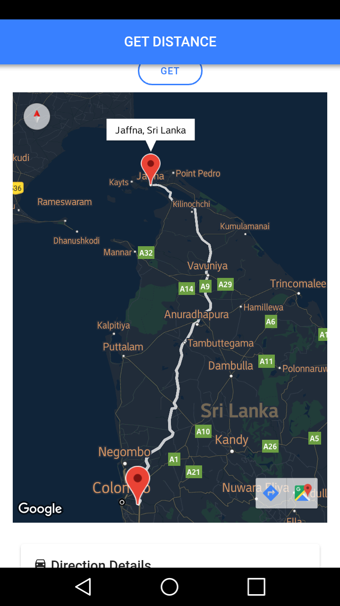
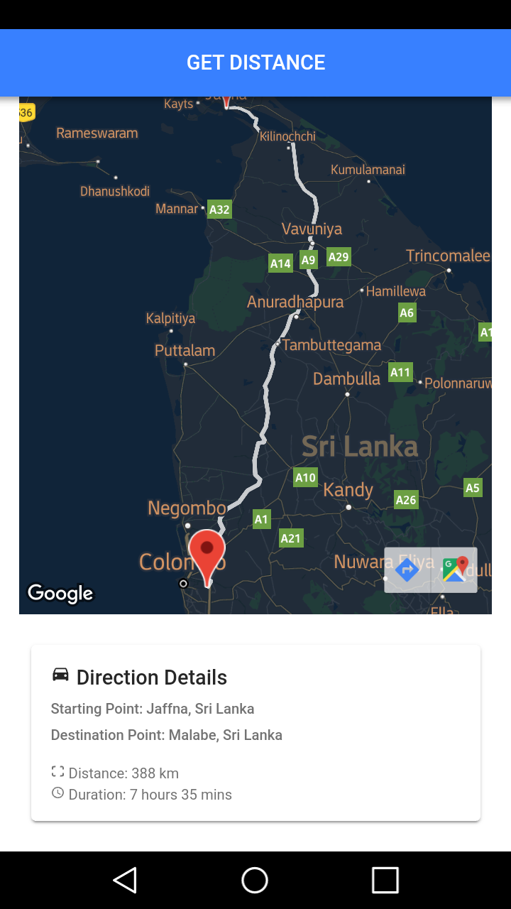

# DISTANCE FINDER

```
Develop the mobile application for get distance and duration between two given location using Ionic 4 and Google Map API.
```

## Method

> First, clone or download the source code from github

> Then, go to the `package.json` and `index.html`, change your Google MAP API

```
"cordova-plugin-googlemaps": {
        "API_KEY_FOR_ANDROID": "<< Google MAP API >>",
        "API_KEY_FOR_IOS": "<< Google MAP API >>",
        ...
      }
```

```
<body>
  <app-root></app-root>
  <script src="https://maps.googleapis.com/maps/api/js?key=<< Google MAP API >>"></script>
</body>
```

> Finally, run the application on mobile :+1:.

## Screenshots









